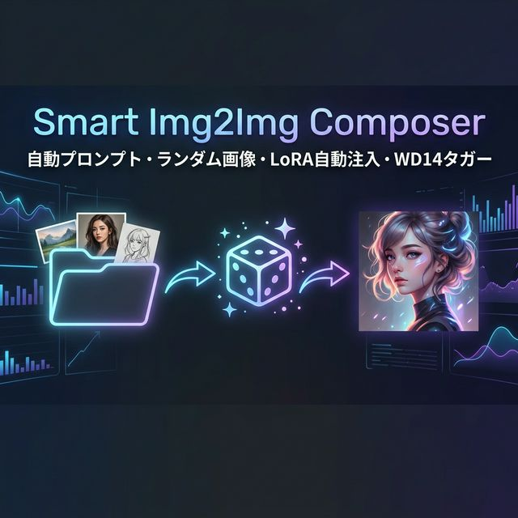
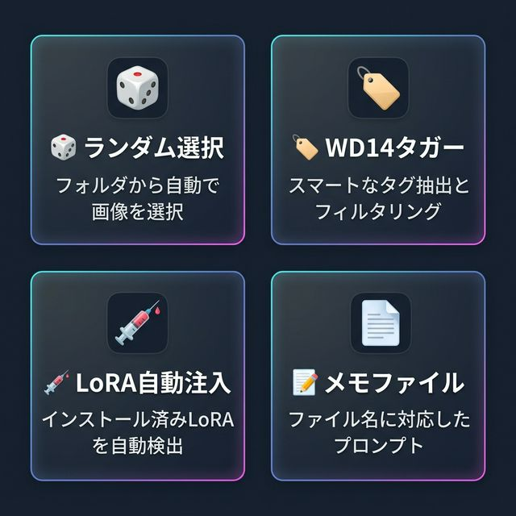
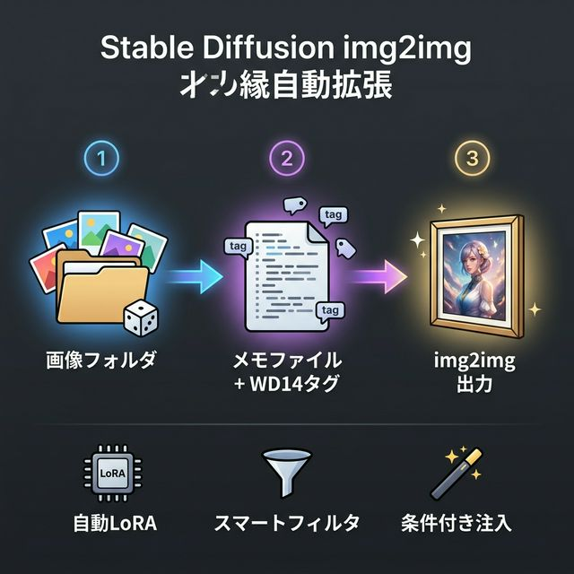

# 🎲 Smart Img2Img Composer



AUTOMATIC1111 Stable Diffusion WebUI 用拡張機能。ランダムに画像を選び、関連するプロンプトを自動取得して img2img を実行します。



### 動作の仕組み



## 🌟 主な機能

1.  **画像＆プロンプトの自動取得**: 指定フォルダ内の画像を「ランダム」または「順番」に自動取得し、メモファイルに紐づいたプロンプトを適用してimg2img実行。
2.  **完全多言語対応 (i18n)**: UIのすべての要素が英語と日本語に完全対応しました。
3.  **注入プロセスの安定化 (v2.1.5)**: バッチ生成時や特定のWebUI環境でも確実に注入されるようロジックを最適化。
4.  **最適マッチング & 重複排除**: 最も類似度の高い1件のみを採用し、タグの重複を自動的に防止します。
5.  **画像サイズの自動調整機能**: モデルに合わせて元画像のアスペクト比を維持したまま解像度を自動最適化。
6.  **WD14 Tagger連携（プロンプト自動生成）**: 画像を解析し、カテゴリ別にフィルターされたタグを自動抽出。
7.  **カスタム辞書機能**: 解析結果を自分好みのフレーズに置換・拡張できます。
8.  **統合型 プロンプト&LoRAマネージャー (v2.1.5)**: キャラクター用とシチュエーション用のLoRAリストを専用タブで管理。**1件ずつの追記**（自動改行付）に対応し、img2img生成時にランダムに注入可能です。また、ワイルドカード等のテキストも記述できます。
9.  **設定の一括保存**: 言語設定、パス、抽出カテゴリなどが `config.json` に一括保存されます。

## 📸 スクリーンショット

### ⚙️ 設定 & プレビュー
画像フォルダ、メモファイル、一致率の設定と、プレビュー結果の確認画面。


### 🏷️ プロンプト & LoRA マネージャー
自分の持っているキャラクター/シチュエーションLoRAを登録・編集できます。専用の入力フォームから1件ずつ手軽に追記（自動で改行が挿入されます）できるほか、リスト全体を直接編集して保存することも可能です。


### 🎲 img2img 連携
img2imgタブ内のチェックボックス1つで有効化。他のスクリプトとも共存可能。
「キャラLoRA / シチュLoRAのランダム適用」を個別にON/OFF可能です。
また、画像サイズの「自動調整ON/OFF」や「スライダーによるベース解像度指定（512px〜2048px）」を設定できます。


---

## 🛠️ インストール

`smart-img2img-composer` フォルダを `stable-diffusion-webui/extensions/` に配置して WebUI を再起動してください。
※プロンプト自動生成機能を利用するには [stable-diffusion-webui-wd14-tagger](https://github.com/toriato/stable-diffusion-webui-wd14-tagger) がインストールされている必要があります。

---

## 📖 使い方 (基本編)

### 1. メモファイルを作る

テキストファイルを作成して以下の形式で書きます：

```text
[タイトル1]
positive:
(masterpiece:1.1), 1girl, portrait

negative:
lowres, blurry, artifact

lora:
add_detail:0.8

[city]
positive:
skyline, sunset, cinematic lighting

[default]
positive:
1girl, simple background

# コメント行（#で始まる行や空行は無視されます）
# positive/negativeの指定がない場合は全体がpositiveとして扱われます。
```

📝 **新機能 Tips:**
*   **`[default]` セクション**: ファイル名に合致するセクションがない場合の「フォールバック」として使用されます（設定の「fallback有効化」がONの場合）。
*   **`lora:` 指定**: メモファイルのセクション内に `lora:` の下で `LoRA名:強度` を書くと、その画像が選ばれた時に固定で適用されます。
*   **ランダム LoRA 注入**: **🏷️ LoRAマネージャー** タブで登録したリストから、生成の度にランダムに1つ選んで注入することも可能です。

### 3. LoRAマネージャーで登録する
1.  「**🏷️ LoRAマネージャー**」タブを開きます。
2.  「キャラクター」または「シチュエーション」を選び、**「1件ずつ追加」**フォームにLoRAのトリガー（例： `<lora:my_character:0.8>, 1girl`）を入力して「➕ リストに追記」を押します（自動で改行して末尾に足されます）。
3.  あるいは、下の大きなテキストエリアでリストを直接編集し、「💾 リストを保存」を押して一括更新することも可能です。
4.  img2img タブの Smart Img2Img Composer アコーディオンで「**🎲 キャラLoRAをランダム適用**」などにチェックを入れると、生成時にリストからランダムに1つ選ばれます。

### 4. テキストファイルを直接編集する (上級者向け)
UIを通さず、拡張機能フォルダ内の以下のファイルを直接編集して保存することも可能です。
- キャラクターリスト: `lora_char.txt`
- シチュエーションリスト: `lora_sit.txt`
- `#` で始まる行はコメントとして無視されます。

### 2. img2img で生成

1.  「**🎲 Random Composer**」タブの「⚙️ 設定 & プレビュー」で画像フォルダとメモファイルのパスを入力して **保存**。
2.  **img2img** タブを開き、下部の「**🎲 Random Composer**」を展開して「**有効化**」にチェック。
3.  Generateボタンを押すと、自動で画像が切り替わりながら生成されます！

---

## ✨ 使い方 (プロンプト自動生成機能)

メモファイルを手作業で作るのが大変な場合は、**🏷️ プロンプト自動生成** タブを使って画像を解析できます。

1.  画像をアップロードし、セクション名（例： `タイトル1`）を入力。
2.  **🏷️ 抽出するタグの種類** で、残したいタグのカテゴリ（構図、キャラ属性、NSFWなど）を選択します。
    *   🔞 **強力なNSFW・フェティッシュタグ抽出**: 一般的な抽出ツールでは弾かれがちなマニアックな体位、フェティッシュ状態、局所・モザイク指定、体液などの詳細なR-18タグも、専用カテゴリ（「行為・アクション」「体液・汚れ系」「局所・モザイク」など）で漏らさず網羅して抽出可能です！
3.  **✨ デフォルトポジティブ** / **🚫 デフォルトネガティブ** に毎回付与したい画質向上タグなどを入力。
4.  **📚 好みのプロンプト置き場（条件付与）** に、以下のように条件タグと追加したいプロンプトを書いておくと、画像にその要素があるときだけ自動で追加されます！
    ```text
    night, city > cyberpunk cityscape, neon lights, cinematic lighting, rain reflections, highly detailed
    sunset, skyline > golden hour lighting, dramatic sky colors, atmospheric perspective
    1girl, smile > beautiful detailed eyes, soft lighting, expressive face, warm atmosphere
    outdoors, wind > flowing hair, dynamic pose, motion blur, cinematic composition
    street, night > urban photography style, moody shadows, film grain, realistic lighting
    ```
5.  **🏷️ タグ解析＆生成** を押し、結果が良ければ **📝 メモファイルに追記** ボタンで保存します。

📝 **Tips**: 入力した設定（タグ種類や辞書など）は「💾 設定を保存」ボタンを押すことで、次回以降も保持されます！

---

## ⚙️ 互換性

ADetailer / ControlNet / WD14 Tagger / Tag Autocomplete / FABRIC 等と競合せず、すべて同時に適用可能です。

## 📦 依存関係 (Dependencies)

オプション機能（プロンプト自動生成など）は WD14 Tagger などの既存の拡張機能に依存しています。本拡張機能自体がサードパーティのモデルやコードを再配布することはありません。
