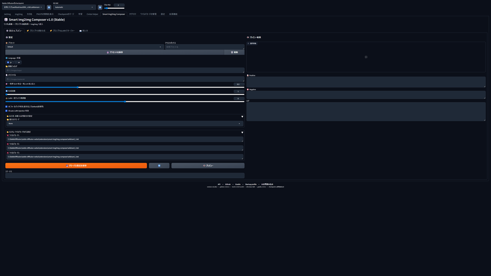
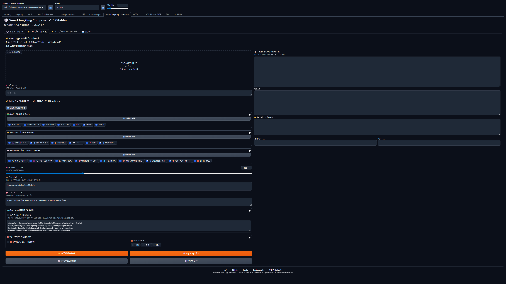
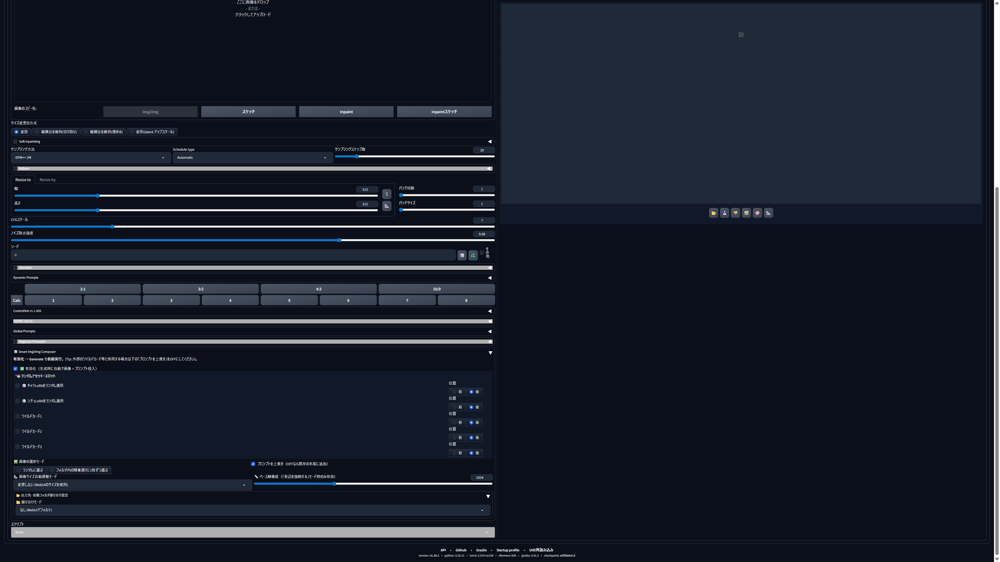
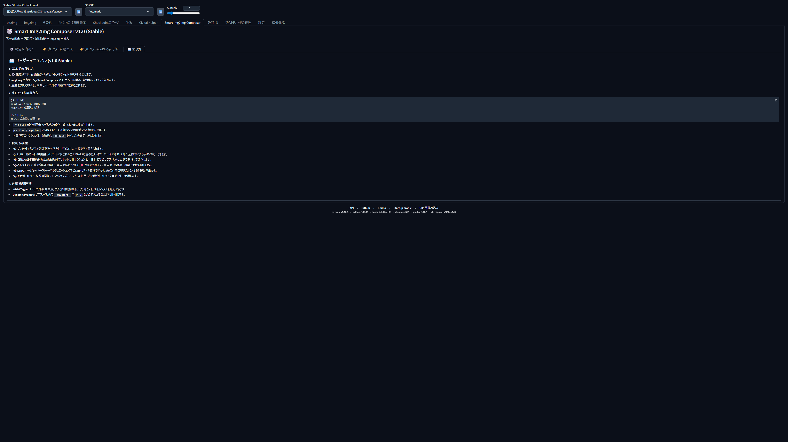

# 🎲 Smart Img2Img Composer v1.0.2 Stable

### **"Mass Production, Met Art Quality."**
**The ultimate batch generation and management solution for YouTube Shorts, TikTok, and SNS content creators.**

A professional-grade extension for AUTOMATIC1111 Stable Diffusion WebUI. Automate the combination of massive image assets and prompts, reducing creative workload by up to 80%.

---

## 🌟 v1.0.2 Stable Highlights

In v1.0.2 Stable, we've integrated numerous critical bug fixes and usability enhancements (automatic LoRA template generation, enhanced EasyPrompt search, etc.) on top of the complete UI/UX overhaul.

### 🎨 Refined Dual-Column Layout
We introduced a streamlined 2-column architecture: **Configuration on the left**, **Preview on the right**. This ensures that every adjustment is immediately visible, creating a frictionless workflow.

### 🩺 Real-Time Path Health Check
Validation is now instantaneous. Each path input features a **✅/❌ Status Icon** that updates in real-time. Never waste time on a "path not found" error after starting a long generation run again.

### 🚀 High-Contrast Professional Interface
Critical action buttons are now styled in **high-visibility Professional Orange**. This intuitive layout ensures that complex batch settings can be executed with confidence and speed.

---

## 🛠️ Powerful Core Systems

### 1. 📂 Advanced Preset Management
Save and load complex configurations — including folder paths, thresholds, and resolutions — as "Presets". Seamlessly switch between different projects or characters with a single click.

### 2. 🧬 High-Precision LoRA Global Tuning
Fine-tune the weights of all active LoRAs simultaneously using a global slider with **0.05 increments**. Achieve the perfect balance and stylistic nuance for every batch.

### 3. 📁 Intelligent Output Sorting
Automatically organize your generated masterpieces into subfolders based on Preset Name, Section Name, or Date. Eliminate the chaos of "mixed-output" directories forever.

---

## ✨ Cutting-Edge Auto-Prompting (WD14 Tagger)

Powered by deep integration with WD14 Tagger.

- **Categorized Smart Extraction**: Filter tags precisely by Composition, Pose, Lighting, NSFW, and more.
- **Global Category Toggle**: Instantly select or deselect groups of tags with one click.
- **Custom Dictionary Translation**: Automatically transform raw extracted tags into your preferred descriptive style or highly-detailed phrases.

---

## 🎲 Seamless img2img Integration

Located natively at the bottom of the img2img tab. Designed to work in perfect harmony with ADetailer, ControlNet, and other popular extensions.

- **Random Injection Slots**: Manage 5 slots (Character, Situation, and 3 Wildcards) for dynamic randomization.
- **Strategic Prompt Positioning**: Choose to inject your random prompts either "Before" or "After" the main prompt for maximum architectural control.

---

## 📖 Quick Start Guide

A comprehensive manual is built directly into the UI via the "**📖 User Manual**" tab.

1.  **Configure**: Set your Image Folder and Memo File in the "⚙️ Settings & Preview" tab.
2.  **Verify**: Save your Preset and ensure all Health Check icons are **✅**.
3.  **Generate**: Enable the extension in the img2img tab and press "Generate".

---

## 📦 Built for Reliability
- **Complete Internationalization (i18n)**: Fully supported in Japanese and English.
- **Enterprise-Grade Compatibility**: Works alongside ADetailer, ControlNet, Dynamic Prompts, and FABRIC.
- **State Persistence**: Securely stores settings in `config.json`.

---

Licensed under the MIT License. Developed for Professional Creators.
