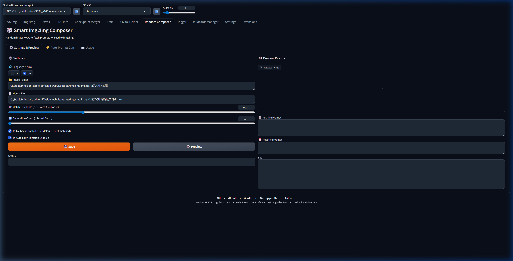
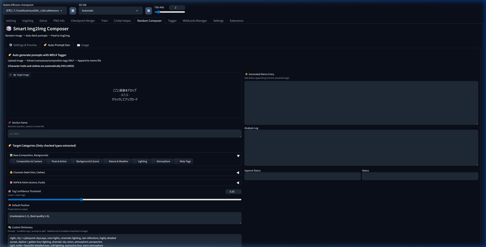
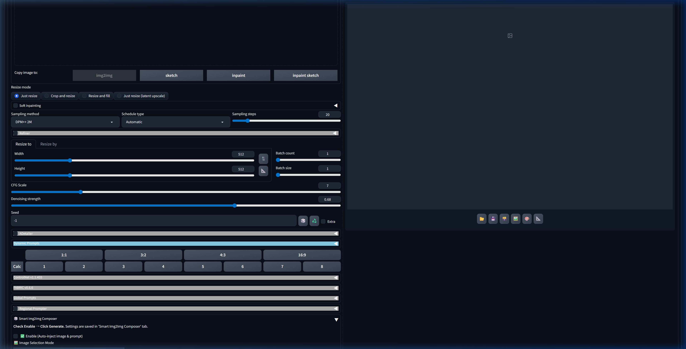

# 🎲 Smart Img2Img Composer


An extension for AUTOMATIC1111 Stable Diffusion WebUI. It randomly selects an image from a specified folder, automatically matches and assigns a prompt based on the image's filename, and seamlessly injects it into img2img.

## 🌟 Overview
Smart Img2Img Composer eliminates the hassle of manually changing prompts and base images when performing large batch img2img operations. By preparing a `memo file` (a prompt dictionary), the extension will automatically pick up the appropriate tags and send them to generating pipeline, making batch processing highly efficient and varied. 


### How it works


## ✨ Features
- **Flexible image selection**: Automatically picks an image from your specified input folder for img2img. Supports both "Random" selection and "Sequential" selection (one by one in alphabetical order, retaining index progress across reloads).
- **Filename-based prompt matching**: Matches the filename (either exact or partial match based on threshold) to a prompt block in your memo file.
- **Auto-resize dimension optimization**: Automatically scales images while maintaining aspect ratio, with a customizable base resolution slider (512px - 2048px) depending on your model (e.g., SD1.5 or SDXL/Illustrious).
- **positive / negative prompt support**: Supports writing distinct positive and negative prompts in the memo file.
- **WD14 Tagger integration**: Built-in tab to auto-generate prompts from your reference images using WD14 Tagger, with smart category filtering.
- **conditional prompt injection system**: define custom dictionary rules to automatically inject stylistic tags when certain trigger words are found.
- **fallback prompt support**: Automatically falls back to a `[default]` section if the image name doesn't match any specific block.
- **automatic LoRA injection support**: Configure `lora:` blocks in your memo file, which automatically injects `<lora:name:weight>` only if the LoRA is actually installed.
- **Complete Internationalization (i18n)**: All UI elements support English and Japanese.
- **Auto-Prompt Generation (WD14 Tagger Integration)**: Analyze images and generate prompts automatically.
- **Injection Stability (v2.1.2)**: Reliable prompt injection that works with batch generation and various WebUI versions.
- **Smart Matching**: Selects the single best-matching prompt based on filename similarity score.
- **Tag Deduplication**: Automatically cleans up redundant tags in the final prompt.
- **Integrated LoRA Manager (NEW v2.2.0)**: Manage Character and Situation LoRA lists in a dedicated tab. Randomly inject them during img2img generation.
- **Consolidated Settings**: All configurations are persisted to `config.json` and persist across browser reloads.
- **Custom Dictionary**: Map specific tags or WD14 results to your own custom phrases.

## 📸 Screenshots

### ⚙️ Settings & Preview
Configure your image folder, memo file, matching threshold, and preview results at a glance.



### 🏷️ LoRA Manager (NEW)
Register and edit your Character or Situation LoRA lists. These saved lists are randomly sampled and applied during the img2img process.


### 🏷️ Prompt Auto-Generation (WD14 Tagger)
Upload an image to auto-extract tags with smart category filtering — composition, pose, lighting, NSFW, and more.



### 🎲 img2img Integration
Enable the extension directly in the img2img tab with a single checkbox. It works seamlessly alongside other scripts.
You can also toggle auto-resizing and configure the base resolution via a slider to optimize sizing for your specific SD model.



---

## 🛠️ Installation

1. Copy the `smart-img2img-composer` folder into your `stable-diffusion-webui/extensions/` directory.
2. Restart the WebUI.
3. *Optional*: For the auto-prompt generation feature, you need to have [stable-diffusion-webui-wd14-tagger](https://github.com/toriato/stable-diffusion-webui-wd14-tagger) installed.

---

## 📖 Usage

### 1. Configure in settings
1. Go to the "**🎲 Smart Composer**" tab, open the "⚙️ Settings & Preview" section.
2. Enter your "Image Folder" and "Memo File" paths, then click **Save**.

### 2. Enable in img2img
1. Go to the **img2img** tab.
2. Expand the "**🎲 Smart Composer**" accordion at the bottom and check "**Enable**".
3. Press the Generate button. The extension will randomly swap the source image and automatically inject the paired prompts.

### 3. Register LoRAs in LoRA Manager
1. Go to the "**🏷️ LoRA Manager**" tab.
2. Select "Character" or "Situation" and enter your LoRA triggers (e.g., `<lora:my_character:0.8>, 1girl, ...`), one per line. Click **Save**.
3. In the img2img tab's Smart Img2Img Composer accordion, check "**🎲 Random Character LoRA**" etc. A random LoRA from your list will be injected on each generation.

### 4. Direct file editing (Advanced)
You can directly edit and save the following files in the extension folder:
- Character list: `lora_char.txt`
- Situation list: `lora_sit.txt`
- Lines starting with `#` are ignored as comments.

---

## 📝 Memo file format

Create a standard text file. It matches the image filename (without extension) to the bracketed `[section]`.

```text
[title1]
positive:
(masterpiece:1.1), 1girl, portrait

negative:
lowres, blurry, artifact

lora:
add_detail:0.8

[city]
positive:
skyline, sunset, cinematic lighting

[default]
positive:
1girl, simple background

# Comments starting with # or empty lines are ignored.
```

## 🔄 Fallback behavior
If the random image does not match any section title (either exactly or via partial threshold match), the extension will check if a `[default]` section exists.
- **Matched**: Applies the `[default]` prompts.
- **Not configured**: Does nothing (ignores).
*Note: This feature can be toggled via the `☑ fallback enabled` checkbox in the UI.*

## 💉 Automatic LoRA injection
You can define a `lora:` block inside any your memo sections. Provide the LoRA name and weight format `name:weight` on each line.
- The extension automatically checks if the LoRA exists in your `modules.lora.available_loras`.
- If installed, it prepends `<lora:name:weight>` to the positive prompt automatically.
- If not installed, it silently skips and outputs `LoRA not found: name` to the console without causing generation errors.
*Note: This feature can be toggled via the `☑ auto LoRA injection enabled` checkbox in the UI.*

## 🤖 WD14 integration & Conditional prompt injection
If you don't want to type memo files manually, use the **🏷️ Prompt Auto-Generation** tab!
- **WD14 Integration**: Upload an image, and it extracts tags (scenes, poses, composition, lighting, characters, and NSFW). Unwanted tags are filtered transparently based on category settings.
  * 🔞 **Advanced NSFW & Fetish Tag Extraction**: Contains a massive built-in dictionary that flawlessly captures highly specific sexual acts, bodily fluids, genital/mosaic states, and maniac fetishes that are usually lost during regular tag filtering.
- **Conditional Prompt Injection**: You can set dictionaries to automatically inject highly detailed stylistic tags into the generated memo text when specific trigger words are detected. Example:
  ```text
  night, city > cyberpunk cityscape, neon lights, cinematic lighting, rain reflections, highly detailed
  sunset, skyline > golden hour lighting, dramatic sky colors, atmospheric perspective
  1girl, smile > beautiful detailed eyes, soft lighting, expressive face, warm atmosphere
  outdoors, wind > flowing hair, dynamic pose, motion blur, cinematic composition
  street, night > urban photography style, moody shadows, film grain, realistic lighting
  ```

---

## ⚙️ Compatibility

Smart Img2Img Composer seamlessly works alongside other popular extensions during the generation pipeline:
- ADetailer
- ControlNet
- WD14 Tagger
- Tag Autocomplete
- FABRIC

## 📦 Dependencies

Optional integrations rely on existing installed extensions such as WD14 Tagger. This extension does not redistribute any third-party models or code.

## 📄 License

This project is licensed under the MIT License. See the `LICENSE` file for details.
