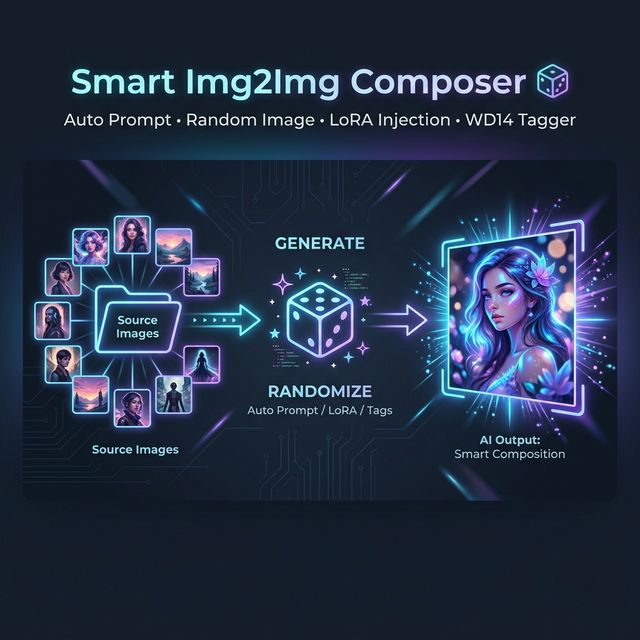
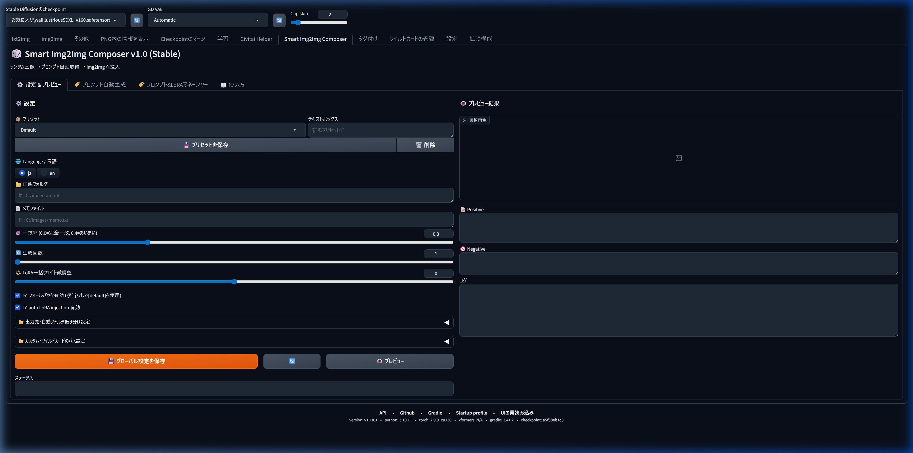
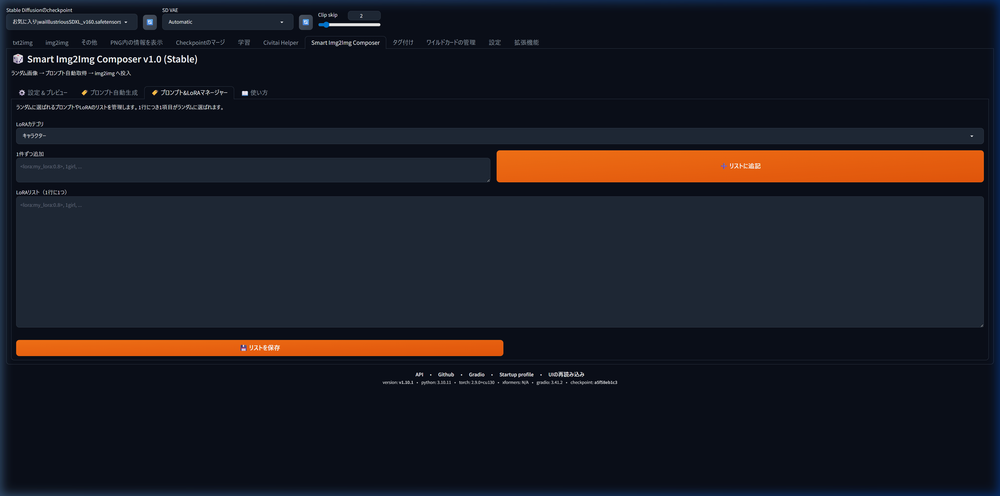
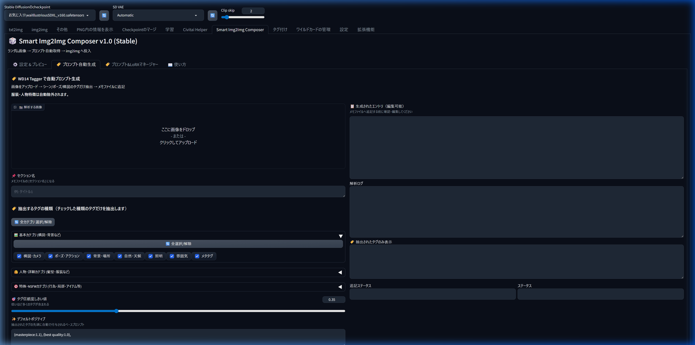
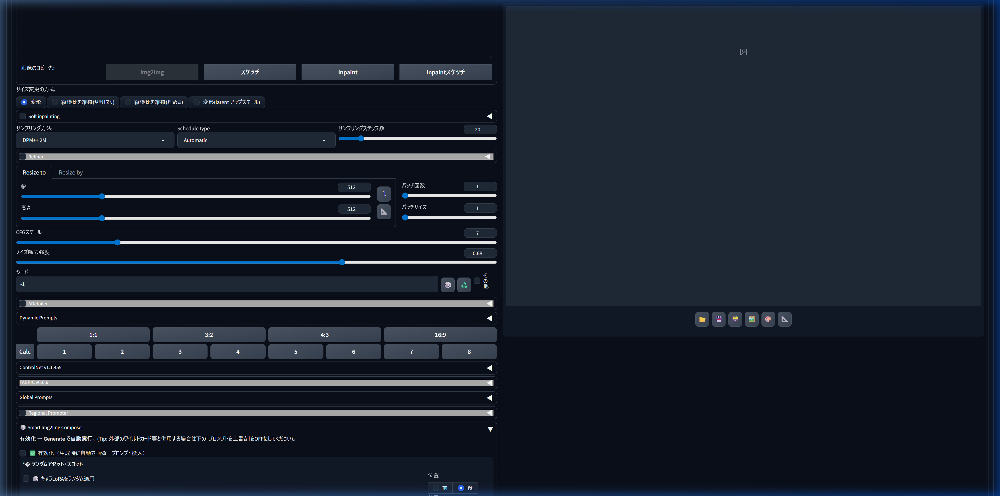

# 🎲 Smart Img2Img Composer



An extension for AUTOMATIC1111 Stable Diffusion WebUI. It randomly selects an image from a specified folder, automatically matches and assigns a prompt based on the image's filename, and seamlessly injects it into img2img.

## 🌟 Overview
Smart Img2Img Composer eliminates the hassle of manually changing prompts and base images when performing large batch img2img operations. By preparing a `memo file` (a prompt dictionary), the extension will automatically pick up the appropriate tags and send them to generating pipeline, making batch processing highly efficient and varied. 


### How it works


## ✨ Features
### 🧩 Generation & Preset Management
1.  **Automatic image & prompt selection**: Automatically selects an image from your folder and matches it with the corresponding prompt from your memo file.
2.  **Preset Management (v2.4.0)**: Save and load multiple configurations (folders, thresholds, etc.) to quickly switch between different workflows.
3.  **Auto-resize dimension optimization**: Automatically scales images while maintaining aspect ratio (512px - 2048px).
4.  **Automatic Output Sorting (v2.4.1)**: Automatically sort generated images into subfolders by Preset Name, Section Name, or Date.
5.  **Consolidated Settings**: All configurations are persisted to `config.json` and persist across browser reloads.

### 🔍 Prompt Analysis & Auto-Generation
6.  **Auto-Prompt Generation**: Built-in tab to analyze images and generate prompts using WD14 Tagger integration.
7.  **Refined Health Check (v2.4.2)**: Localized **✅/❌ icons** next to each path input for real-time validation.
8.  **Smart Matching**: Selects the single best-matching prompt based on filename similarity and cleans up redundant tags.
9.  **Conditional prompt injection**: Define custom dictionary rules to automatically inject stylistic tags when certain trigger words are found.
10. **Fallback prompt support**: Automatically falls back to a `[default]` section if no match is found.

### ⚙️ Adjustment & Flexible Customization
11. **LoRA Weight Global Offset (v2.4.1)**: Fine-tune all LoRA weights in a preset at once with a single slider.
12. **Integrated Prompt & LoRA Manager**: Manage up to 5 random slots (Character, Situation, and 3 Wildcards) with **Front/Back position toggles**.
13. **Complete Internationalization (i18n)**: All UI elements support English and Japanese.
## 📜 Version History

- **v1.0 (Stable)**: **Official Release**. Integrated 15 critical bug fixes, added Global Category Toggle, optimized accordion default states, and significantly improved overall stability.
- **v2.4.2**: **Refined Health Check** (localized ✅/❌ icons), **UI Stability Fixes** (Gradio crash fix), and updated manual.
- **v2.4.1**: **LoRA Global Offset**, **Output Sorting**, and bug fixes for folder paths.
- **v2.4.0**: **Preset System** (Save/Load configurations) and UI/UX overhaul.
- **v2.3.2**: **Path Quoting Support** (`strip('"')`) and **Debug Logging** for prompt loading.
- **v2.3.1**: Hotfix for `get_random_asset` and manager connectivity.
- **v2.3.0**: **Custom Wildcard Paths** (flexible asset files) and **UI nesting** (nested accordion).
- **v2.2.1**: Bug fixes for `autogen_prompt`, fuzzy matching accuracy, and performance caching.

## 📸 Screenshots

### ⚙️ Settings & Preview
Configure your image folder, memo file, matching threshold, and preview results at a glance.



### 🏷️ LoRA Manager
Register and edit your Character or Situation LoRA lists. You can easily append new entries one by one using the dedicated input form (automatic newline insertion), or edit the entire list directly in the text area.



### ✨ Prompt Auto-Generation (WD14 Tagger)
Upload an image to auto-extract tags with smart category filtering — composition, pose, lighting, NSFW, and more. Use custom dictionaries to transform tags into your favorite style.



### 🎲 img2img Integration
Enable the extension directly in the img2img tab with a single checkbox. It works seamlessly alongside other scripts. Use the optimized accordion to manage random slot injections and auto-resizing.



---

## 🛠️ Installation

1. Copy the `smart-img2img-composer` folder into your `stable-diffusion-webui/extensions/` directory.
2. Restart the WebUI.
3. *Optional*: For the auto-prompt generation feature, you need to have [stable-diffusion-webui-wd14-tagger](https://github.com/toriato/stable-diffusion-webui-wd14-tagger) installed.

---

## 📖 Usage

### 1. Configure in settings
1. Go to the "**🎲 Smart Composer**" tab, open the "⚙️ Settings & Preview" section.
2. Enter your "Image Folder" and "Memo File" paths, then click **Save**.

### 2. Register LoRAs in LoRA Manager
1. Go to the "**🏷️ LoRA Manager**" tab.
2. Select "Character" or "Situation" and enter your LoRA trigger (e.g., `<lora:my_character:0.8>, 1girl`) in the **"Add one by one"** form, then click "➕ Append to List". It will be added to the end of the file with a newline.
3. Alternatively, you can edit the entire list in the large text area below and click "💾 Save List".
4. In the img2img tab's Smart Img2Img Composer accordion, check "**🎲 Random Character LoRA**" etc. A random LoRA from your list will be injected on each generation.

### 3. Enable & Generate in img2img
1. Go to the **img2img** tab.
2. Expand the "**🎲 Smart Composer**" accordion at the bottom and check "**Enable**".
3. Press the Generate button. The extension will automatically swap the source image and inject the paired prompts for each image.

### 4. Direct file editing (Advanced)
You can directly edit and save the following files in the extension folder:
- Character list: `lora_char.txt`
- Situation list: `lora_sit.txt`
- Lines starting with `#` are ignored as comments.
- Lines starting with `#` are ignored as comments.

---

## 📝 Memo file format

Create a standard text file. It matches the image filename (without extension) to the bracketed `[section]`.

```text
[title1]
positive:
(masterpiece:1.1), 1girl, portrait

negative:
lowres, blurry, artifact

lora:
add_detail:0.8

[city]
positive:
skyline, sunset, cinematic lighting

[default]
positive:
1girl, simple background

# Comments starting with # or empty lines are ignored.
```

## 🔄 Fallback behavior
If the random image does not match any section title (either exactly or via partial threshold match), the extension will check if a `[default]` section exists.
- **Matched**: Applies the `[default]` prompts.
- **Not configured**: Does nothing (ignores).
*Note: This feature can be toggled via the `☑ fallback enabled` checkbox in the UI.*

## 💉 Automatic LoRA injection
You can define a `lora:` block inside any your memo sections. Provide the LoRA name and weight format `name:weight` on each line.
- The extension automatically checks if the LoRA exists in your `modules.lora.available_loras`.
- If installed, it prepends `<lora:name:weight>` to the positive prompt automatically.
- If not installed, it silently skips and outputs `LoRA not found: name` to the console without causing generation errors.
*Note: This feature can be toggled via the `☑ auto LoRA injection enabled` checkbox in the UI.*

## 🤖 WD14 integration & Conditional prompt injection
If you don't want to type memo files manually, use the **🏷️ Prompt Auto-Generation** tab!
- **WD14 Integration**: Upload an image, and it extracts tags (scenes, poses, composition, lighting, characters, and NSFW). Unwanted tags are filtered transparently based on category settings.
  * 🔞 **Advanced NSFW & Fetish Tag Extraction**: Contains a massive built-in dictionary that flawlessly captures highly specific sexual acts, bodily fluids, genital/mosaic states, and maniac fetishes that are usually lost during regular tag filtering.
- **Conditional Prompt Injection**: You can set dictionaries to automatically inject highly detailed stylistic tags into the generated memo text when specific trigger words are detected. Example:
  ```text
  night, city > cyberpunk cityscape, neon lights, cinematic lighting, rain reflections, highly detailed
  sunset, skyline > golden hour lighting, dramatic sky colors, atmospheric perspective
  1girl, smile > beautiful detailed eyes, soft lighting, expressive face, warm atmosphere
  outdoors, wind > flowing hair, dynamic pose, motion blur, cinematic composition
  street, night > urban photography style, moody shadows, film grain, realistic lighting
  ```

---

## ⚙️ Compatibility

Smart Img2Img Composer seamlessly works alongside other popular extensions during the generation pipeline:
- ADetailer
- ControlNet
- WD14 Tagger
- Tag Autocomplete
- FABRIC

## 📦 Dependencies

Optional integrations rely on existing installed extensions such as WD14 Tagger. This extension does not redistribute any third-party models or code.

## 📄 License

This project is licensed under the MIT License. See the `LICENSE` file for details.
